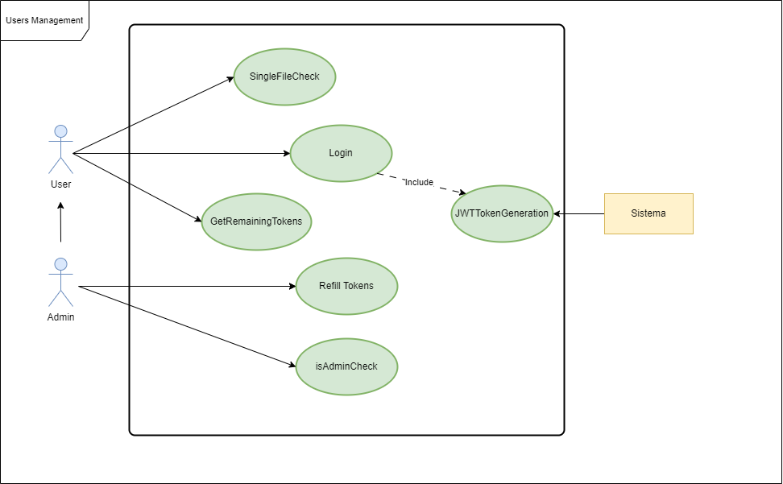
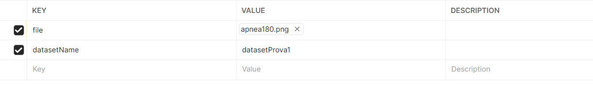
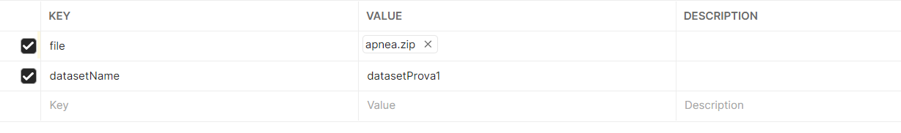

# Inference Management System for Sleep Apnea Syndrome

## Obiettivo del progetto
Il progetto proposto consiste nella realizzazione di un backend per la gestione delle inferenze fatte su immagini (con estensione .png) di spettrogrammi, tramite l'utilizzo di due modelli di Deep-Learning pre-addestrati per l'individuazione di apnee notturne.
I modelli messi a disposizione sono stati addestrati su un diverso numero di pazienti, in particolare uno su 10 e l'altro su 20, il che risulta in prestazioni differenti.
Il backend realizzato permette agli utenti di autenticarsi, generare dataset e fare infereza su questi ultimi. Le operazioni di inferenza e l'aggiunta di materiale multimediale (singole immagini o cartelle zip contenenti immagini) sono consentite agli utenti a condizione che dispongano di un numero sufficiente di token. Quando uno degli utenti esaurisce i token a disposizione, può richiederne all'admin, il quale è autorizzato a ricaricarli. Il tutto è gestito da un sistema di autenticazione JWT (JSON Web Token).

## Progettazione Database
Il server trova appoggio in un database PostgreSQL, impostato su un server esterno. Le credenziali di accesso, come nome del database, utente, password ed host, sono salvate come variabili di ambiente.
Il database è formato da tre entità: datasets, spectrograms e users, ciascuno con i propri attributi.
Di seguito riportiamo il diagramma relazionale utilizato per la progettazione del database:

<p align="center">
    
</p>

## Diagrammi dei Casi D'Uso
I diagrammi dei casi d'uso, esposti di seguito, permettono di identificare in maniera chiara gli attori che interagiscono con il sistema e descrivere tale interazioni; inoltre, essi ci forniscono una panoramica delle funzionalità del sistema stesso.

### Attori
Gli attori sono le entità che interagiscono con il nostro sistema. In particolare ne sono state individuate 3 tipologie: User, Admin e System
<p align="center">
    
</p>

### Gestione Utenti
Tale diagramma riporta le azioni per la gestione delle attività relative agli utenti
<p align="center">
    
</p>

### Gestione Datasets
Tale diagramma riporta le azioni per la gestione delle attività relative ai dataset
<p align="center">
    
</p>

## Diagrammi delle Sequenze
I diagrammi di sequenza, in fase di progettazione, sono fondamentali per descrivere l'interazione sequenziale espresse ad alto livello di astrazione tra le varie entità all'interno del sistema durante l'esecuzione di una rotta. Di seguito andiamo a riportare i diagrammi che descrivono il funzionamento delle 11 rotte elaborate. 

### Creazione di un dataset vuoto
<p align="center">
    
</p>

### Cancellazione di un dataset
<p align="center">
    
</p>

### Modifica di un dataset
<p align="center">
    
</p>

### Inferenza su un dataset
<p align="center">
    
</p>

### Elenco dei dataset dell'utente loggato
<p align="center">
    
</p>

### Stato di avanzamento dell'inferenza
<p align="center">
    
</p>

### Login
<p align="center">
    
</p>

### Controllo dei token residui
<p align="center">
    
</p>

### Aggiunta di token ad un utente
<p align="center">
    
</p>

### Aggiunta di un nuovo spettrogramma
<p align="center">
    
</p>

### Aggiunta di una cartella zip
<p align="center">
    
</p>


## Pattern Utilizzati
Durante lo sviuppo del sistema sono stati utilizzati diversi pattern per garantire una gestione maggiormente efficiente del backend
### Design pattern 
**Singleton** - il pattern Singleton è generalmente utilizzato per assicurarsi che una determinata classe presenti una sola istanza, la quale funge da punto di accesso globale. Nel nostro caso la configurazione del database è progettata per essere singleton, garantendo che esista una sola istanza della connessione al database durante l'intero ciclo di vita dell'applicazione, consentendoci di milgiorare le prestazioni e la gestione delle risorse, oltre a fornire metodi per l'autenticazione e la connessione al database stesso.

**DAO** - il pattern DAO è usato per separare la logica di accesso ai dati da quella di business. Nel nostro progetto ogni entità presente nel database (Utenti, Datasets e Spectrograms) presenta un'apposita classe DAO che implementa i metodi CRUD (creazione, lettura, aggiornamento e cancellazione) definiti nell'interfaccia generica. In questo modo è possibile gestire tali operazioni dei dati nel dataset senza esporre i dettagli di implementazione del database stesso.

**Factory Method** - il Factory Method è utilizzato nel nostro progetto per centralizzare ed uniformare gli errori. Tramite la classe errorFactory è fornito un metodo statico che, in base al tipo di errore passato come paramtetro, istanzia e restituisce oggetti delle varie sottoclassi ('CustomError', 'NotFoundError',...). Tale implementazione ci permette di gestire in modo coerente gli errori in tutto il codice e lanciare appropriati messaggi e status code.

**Middleware pattern** - il Middleware pattern è utilizzato per gestire operazioni comuni di autenticazione e validazione delle richieste HTTP. In particolare i middleware utilizzati sono tre:
1. **authMiddleware**: gestisce l'autenticazione delle richieste; in particolare, la presenza del JWT token e la sua validità.
2. **isAdminMiddleware**: controlla se l'utente autenticato gode dei privilegi di amministratore.
3. **checkValidJson**: gestisce la validazione del formato JSON dele richuieste in entrata.

### Architectural pattern 

**Repository pattern** - il Repository pattern è ampiamente utilizzato nel progetto proposto per separare la logica dei dati da quella di business. Ogni entità principale, come Dataset, User e Spectrogram, è gestita attraverso un repository dedicato. Tale pattern definisce operazioni CRUD oltre che metodi di alto livello per l'accesso ai dati come _getAllDatasetByUser_, _getByName_,...

**MVC** - l'MVC è un pattern architetturale la cui logica funzionamento si basa sulla suddivisione del sistema in tre componenti _Model_, _View_ e _Controller_.

* **Model** - gestisce i dati e la logica di business. Sono definiti i modelli per Dataset, Spectrogram e User in cui sono presenti gli attributi e le relazioni per facilitare l'interazione con il database. Ogni classe modello estende la classe di base "model" di Sequelize definendo attributi specifici
* **View** - non è esplicitamente presente una View, il controller agisce da interfaccia per gestire le richieste e fornire risposte ai clienti
* **Controller** - gestisce l'interazione dell'utente con i dati. Ogni metodo gestisce le rotte ed eventuali errori, valida i dati ed interagisce con il modello corrispondente.


## Avvio
Per poter correttamente avviare il sistema bisogna disporre dei seguenti requsiti:

1. Docker
2. Docker Compose
3. Node.js
4. Express
5. Sequelize

### Istruzioni 
1. Clonare il repository nella propria directory o scaricare direttamente il file .zip:

   `git clone https://github.com/LauraFe01/ProgettoPA`
3. Eseguire la build del progetto
   
   `docker-compose build`
4. Eseguire il run del progetto
   
   `docker-compose up`
   
In alternativa si può eseguire build e run del progetto insieme con il comando:

`docker-compose up --build`

il database è già fornito con i dati minimali per l'utilizzo, in particolare troviamo gli utenti:

```
    { email: 'user@example.com', password: 'user', numToken: 100, isAdmin: false },
    { email: 'admin@example.com', password: 'admin', numToken: 100, isAdmin: true },

```

e un dataset per l'utente admin, con la seguente struttura:

```
    {
        "status": "Empty Dataset added",
        "statusCode": 201,
        "newDataset" : {
            "name": "dataset"
            "description": "Il mio dataset",
            "userId" : 2,
            "tags": [
                "primoDB",
                "test"]
    }

```

Le password per ciascun utente vengono salvate nel database hashate, in modo da garantire un maggior livello di sicurezza.

#### Note:
Se si desidera resettare il database lo si può fare impostando `await db.sync({ force: false });` con force: true in _init_database.ts_.
Nel caso in cui si voglia ripopolare il database (con i dati dei due utenti di default) bisogna scommentare l'istruzione `seed()` collocata alla riga 25 del file _server.ts_.
Inoltre, c'è la possibilità di pulire la coda del gestore bullMQ scommentando l'istruzione cleanQueue() situata nel file _server.ts_.

## Rotte
Tramite Postman è possibile eseguire chiamate alle seguenti rotte

### Creazione di un dataset vuoto
#### Rotta
POST http://localhost:3000/emptydataset
#### Descrizione
##### Authorization
Per eseguire questa rotta è necessario che l'utente abbia effettuato il login e ottenuto il token di autenticazione JWT. 

`Auth Type`: Bearer Token.

`Token`: _token JWT_
##### Parametri richiesta
Nel body devono essere inseriti i seguenti parametri

`name`: nome univoco fornito al nuovo dataset

`description`: descrizione del dataset creato

`tags` (opzionale): lista dei tags associati al dataset sotto forma di lista di stringhe
##### Parametri risposta
`status`: messaggio che indica lo stato in cui si trova la richiesta, ovvero se è andata a buon fine, se ci sono errori, ecc

`statusCode`: codice standardizzato HTTP che specializza lo status della richiesta

`newDataset`: indica le specifiche del nuovo dataset aggiunto; in particolare contiene:
* `name`: nome del nuovo dataset
* `description`: descrizione del nuovo dataset
* `tags`: lista dei tags associati al dataset
* `userId`: id dell'utente che ha creato il nuovo dataset
#### Esempio
##### Body della richiesta
```
{
  "name":"datasetProva1",
  "description":"datset prova",
  "tags": ["primoDB", "prova"]
}
```
##### Risposta
```
{
    "status": "Empty Dataset added",
    "statusCode": 201,
    "newDataset": {
        "name": "datasetProva1",
        "description": "datset prova",
        "userId": 1,
        "tags": ["primoDB", "prova"]
    }
}
```

### Cancellazione di un dataset
#### Rotta
PUT http://localhost:3000/dataset/:name/cancel
#### Descrizione
##### Authorization
Per eseguire questa rotta è necessario che l'utente abbia effettuato il login e ottenuto il token di autenticazione JWT. 

`Auth Type`: Bearer Token.

`Token`: _token JWT_
##### Parametri richiesta
All'interno dei _Path Variables_ si deve inserire

`name`: nome del dataset da cancellare
##### Parametri risposta

`message`: messaggio che indica lo stato in cui si trova la richiesta, ovvero se è andata a buon fine, se ci sono errori, ecc

`statusCode`: codice standardizzato HTTP che specializza lo status della richiesta

#### Esempio
##### Risposta
```
{
    "message": "Dataset cancelled successfully",
    "statusCode": 200
}
```

### Modifica di un dataset
#### Rotta
PATCH http://localhost:3000/dataset/:name/update
#### Descrizione
##### Authorization
Per eseguire questa rotta è necessario che l'utente abbia effettuato il login e ottenuto il token di autenticazione JWT. 

`Auth Type`: Bearer Token.

`Token`: _token JWT_
##### Parametri richiesta
All'interno del body deve essere contenuto

`updateField`: dizionario chiave-valore con il nome dei campi da voler modificare e relativo valore

e all'interno dei _Path Variables_ si deve inserire

`name`: nome del dataset da modificare
##### Parametri risposta

`status`: messaggio che indica lo stato in cui si trova la richiesta, ovvero se è andata a buon fine, se ci sono errori, ecc

`statusCode`: codice standardizzato HTTP che specializza lo status della richiesta

`newDataset`: indica le specifiche del nuovo dataset aggiunto; in particolare contiene:
* `name`: nome del nuovo dataset
* `description`: descrizione del nuovo dataset
* `tags`: lista dei tags associati al dataset
* `userId`: id dell'utente che ha creato il nuovo dataset
  
#### Esempio
Supponiamo di voler cambiare il nome ad un dataset
##### Body della richiesta
```
{
    "name":"datasetCambiato"
}
```
##### Risposta
```
{
    "status": "Dataset successfully updated!",
    "statusCode": 200,
    "dataset": {
        "id": 1,
        "name": "datasetCambiato",
        "description": "datset prova",
        "userId": 1,
        "tags": ["primoDB", "prova"],
        "deletedAt": null,
        "createdAt": "2024-07-18T14:24:43.356Z",
        "updatedAt": "2024-07-18T14:37:12.885Z"
    }
}
```
Nell'esempio riportato si è voluto modificare il nome del dataset ma è possibile inserire un numero maggiore di campi se desiderato.

### Inferenza su un dataset
#### Rotta
POST http://localhost:3000/startInference/:datasetName
#### Descrizione
##### Authorization
Per eseguire questa rotta è necessario che l'utente abbia effettuato il login e ottenuto il token di autenticazione JWT. 

`Auth Type`: Bearer Token.

`Token`: _token JWT_
##### Parametri richiesta
All'interno dei _Path Variables_ si deve trovare

`datasetName`: nome del dataset su cui fare inferenza
##### Parametri risposta

`message`: messaggio che indica lo stato in cui si trova la richiesta, ovvero se è andata a buon fine, se ci sono errori, ecc

`jobId`: codice identificativo con cui l'inferenza è stata aggiunta alla coda e con la quale può essere richiamata
#### Esempio
##### Risposta
```
{
    "message": "Inference added to the queue with id:",
    "jobId": "27"
}
```

### Elenco dei dataset dell'utente loggato
#### Rotta
GET http://localhost:3000/datasets
#### Descrizione
##### Authorization
Per eseguire questa rotta è necessario che l'utente abbia effettuato l'accesso tramite JWT. 

`Auth Type`: Bearer Token.

`Token`: _token JWT_
##### Parametri risposta

`Datasets[]`: lista dei dataset, con i loro attributi, creati dall'utente loggato
* `id`: codice identificativo del dataset
* `name`: nome del dataset
* `description`: descrizione del dataset
* `userId`: codice identificativo dell'utente che ha creato il dataset
* `tags[]`: metadati associati al dataset
* `deletedAt`: campo che indica la cancellazione logica del dataset
* `createdAt`: data e ora di creazione del dataset
* `updatedAt`: data e ora di modifica del dataset
* `spectrograms[]`: lista dei file presenti all'interno del dataset
#### Esempio
##### Risposta
```
[
    {},
    {
        "dataset": {
            "id": 2,
            "name": "dataset3",
            "description": "Il mio dataset",
            "userId": 1,
            "tags": [
                "primoDB",
                "prova"
            ],
            "deletedAt": null,
            "createdAt": "2024-07-18T14:27:45.907Z",
            "updatedAt": "2024-07-18T14:27:45.907Z"
        },
        "spectrograms": [
            "apnea167.png"
        ]
    },
    {
        "dataset": {
            "id": 7,
            "name": "dataset1",
            "description": "Il mio dataset",
            "userId": 1,
            "tags": [
                "primoDB",
                "prova",
                "test",
                1
            ],
            "deletedAt": null,
            "createdAt": "2024-07-18T14:58:16.629Z",
            "updatedAt": "2024-07-18T14:58:16.629Z"
        },
        "spectrograms": [
            "nonapnea0.png",
            "nonapnea1.png",
            "nonapnea10.png",
            "nonapnea2.png",
            "nonapnea3.png",
            "nonapnea4.png",
            "nonapnea5.png",
            "nonapnea6.png",
            "nonapnea7.png",
            "nonapnea8.png",
            "nonapnea9.png"
        ]
    },
    {
        "dataset": {
            "id": 8,
            "name": "datasetProva1",
            "description": "datset prova",
            "userId": 1,
            "tags": [],
            "deletedAt": null,
            "createdAt": "2024-07-18T15:09:53.737Z",
            "updatedAt": "2024-07-18T15:09:53.737Z"
        },
        "spectrograms": [
            "apnea181.png",
            "apnea107.png",
            "apnea167.png",
            "apnea174.png",
            "apnea180.png",
            "apnea181.png",
            "apnea247.png",
            "apnea259.png",
            "apnea268.png",
            "apnea285.png",
            "apnea290.png"
        ]
    }
]
```

### Stato di avanzamento dell'inferenza
#### Rotta
GET http://localhost:3000/inferenceStatus/:jobId
#### Descrizione
##### Authorization
Per eseguire questa rotta è necessario che l'utente abbia effettuato il login e ottenuto il token di autenticazione JWT. 

`Auth Type`: Bearer Token.

`Token`: _token JWT_
##### Parametri richiesta
All'interno dei _Path Variables_ si deve trovare

`jobId`: id dell'inferenza di cui controllare lo stato
##### Parametri risposta

`status`: stato in cui si trova l'inferenza (completed, failed, pending,...)

`result[]`: lista di risultati ottenuti dall'inferenza
* `name`: nome del file su cui si è fatta inferenza
* `prediction`: predizione del modello (1= apnea, 0= non apnea)
#### Esempio
##### Risposta
Dipende dallo stato in cui si trova l'inferenza indicata. Di seguito riportiamo quando essa è _Completed_. Da notare il fatto che il risultato delle predizioni sia sempre 1 nell'esempio, indicando una costante presenza di apnea, tale risultato è corretto poichè i file passati al dataset su cui è avvenuta l'inferenza contenevano unicamente immagini di apnee.
```
{
    "status": "Completed",
    "result": [
        {
            "name": "apnea181.png",
            "prediction": 1
        },
        {
            "name": "apnea107.png",
            "prediction": 1
        },
        {
            "name": "apnea167.png",
            "prediction": 1
        },
        {
            "name": "apnea174.png",
            "prediction": 1
        },
        {
            "name": "apnea180.png",
            "prediction": 1
        },
        {
            "name": "apnea181.png",
            "prediction": 1
        },
        {
            "name": "apnea247.png",
            "prediction": 1
        },
        {
            "name": "apnea259.png",
            "prediction": 1
        },
        {
            "name": "apnea268.png",
            "prediction": 1
        },
        {
            "name": "apnea285.png",
            "prediction": 1
        },
        {
            "name": "apnea290.png",
            "prediction": 1
        }
    ]
}
```

### Login
#### Rotta
POST http://localhost:3000/login
#### Descrizione
##### Parametri richiesta
All'interno del body deve essere contenuto

`email`: email dell'utente che vuole effettuare il login

`password`: password dell'utente che vuole effettuare il login

##### Parametri risposta

`status`: messaggio che indica lo stato in cui si trova la richiesta, ovvero se è andata a buon fine, se ci sono errori, ecc

`statusCode`: codice standardizzato HTTP che specializza lo status della richiesta

`token`: token JWT associato all'utente loggato e tramite il quale verrà concessa l'autorizzazione ad operare le altre rotte

#### Esempio
##### Body della richiesta
```
{
  "email":"user@example.com",
  "password": "user"
}
```
##### Risposta
```
{
    "status": "successfully logged in ",
    "statusCode": 200,
    "token": "exampleToken"
}
```

### Controllo dei token residui
#### Rotta
GET http://localhost:3000/remainingTokens
#### Descrizione
##### Authorization
Per eseguire questa rotta è necessario che l'utente abbia effettuato il login e ottenuto il token di autenticazione JWT. 

`Auth Type`: Bearer Token.

`Token`: _token JWT_
##### Parametri risposta
`status`: messaggio che indica lo stato in cui si trova la richiesta, ovvero se è andata a buon fine, se ci sono errori, ecc

`statusCode`: codice standardizzato HTTP che specializza lo status della richiesta

`numToken`: numero di token residui dell'utente
#### Esempio
##### Risposta
```
{
    "status": "OK ",
    "statusCode": 200,
    "numToken": 1.8499999999999996
}
```

### Aggiunta di token ad un utente
#### Rotta
POST http://localhost:3000/refillTokens
#### Descrizione
##### Authorization
Per eseguire questa rotta è necessario che l'admin abbia effettuato il login e ottenuto il token di autenticazione JWT. 

`Auth Type`: Bearer Token.

`Token`: _token JWT_
##### Parametri richiesta
All'interno del body deve essere contenuto

`email`: email dell'utente a cui si vogliono assegnare i token

`numToken`: numero di token da assegnare all'utente
##### Parametri risposta
`message`: messaggio che indica lo stato in cui si trova la richiesta, ovvero se è andata a buon fine, se ci sono errori, ecc

`statusCode`: codice standardizzato HTTP che specializza lo status della richiesta

`userEmail`: email dell'utente a cui sono stati assegnati i token

`numToken`:  numero di token residui dell'utente
#### Esempio
##### Body della richiesta
```
{
    "userEmail": "user1@example.com",
    "newTokens": 10
}
```
##### Risposta
```
{
    "message": "Token number updated",
    "statusCode": 200,
    "userEmail": "user1@example.com",
    "numToken": 97.64999999999999
}
```

### Aggiunta di un nuovo spettrogramma
#### Rotta
POST http://localhost:3000/spectrogram
#### Descrizione
##### Authorization
Per eseguire questa rotta è necessario che l'utente abbia effettuato il login e ottenuto il token di autenticazione JWT. 

`Auth Type`: Bearer Token.

`Token`: _token JWT_
##### Parametri richiesta
All'interno del body, come _form-data_, deve essere contenuto

`file`: si sceglie il file in formato png da inserire nel dataset 

`datasetName`: nome del dataset in cui inserire i file
##### Parametri risposta
`status`: messaggio che indica lo stato in cui si trova la richiesta, ovvero se è andata a buon fine, se ci sono errori, ecc

`statusCode`: codice standardizzato HTTP che specializza lo status della richiesta

`newSpectrogram`: indica le specifiche del nuovo spettrogramma aggiunto; in particolare contiene:
* `name`: nome del nuovo file
* `data`: attributi specifici del file che è stato inserito
  * `type`: tipo di dato inserito
  * `data`: rappresentazione dell'immagine come Buffer
* `datasetId`: codice identificativo del dataset in cui è stato aggiunto lo spettrogramma

#### Esempio
##### Body della richiesta
<p align="center">
    
</p>

##### Risposta
```
{
    "status": "spectrogram added",
    "statusCode": 201,
    "newSpectrogram": {
        "name": "apnea181.png",
        "data": {
            "type": "Buffer",
            "data": [
                137,
                80,
                78,
                71,
                13,
                10,
                26,
                10,
                0,
                0,
                212,
                ...,
            ]
        },
        "datasetId": 8
    }
}
```

### Aggiunta di una cartella zip
#### Rotta
POST http://localhost:3000/uploadFilesFromZip
#### Descrizione
##### Authorization
Per eseguire questa rotta è necessario che l'utente abbia effettuato il login e ottenuto il token di autenticazione JWT. 

`Auth Type`: Bearer Token.

`Token`: _token JWT_
##### Parametri richiesta
All'interno del body, come _form-data_, deve essere contenuto

`file`: si sceglie la cartella zip da inserire nel dataset 

`datasetName`: nome del dataset in cui inserire i file
##### Parametri risposta
`status`: messaggio che indica lo stato in cui si trova la richiesta, ovvero se è andata a buon fine, se ci sono errori, ecc

`statusCode`: codice standardizzato HTTP che specializza lo status della richiesta

#### Esempio
##### Body della richiesta
<p align="center">
    
</p>

##### Risposta
```
{
    "status": "Spectrograms successfully uploaded",
    "statusCode": 201
}
```

## Collection Postman
Il file contenente la collection di Postman con tutte le rotte si può trovare [qui](path/to/your/file.json). 

## Contributori
* Laura Ferretti
* Alessandra D'Anna
