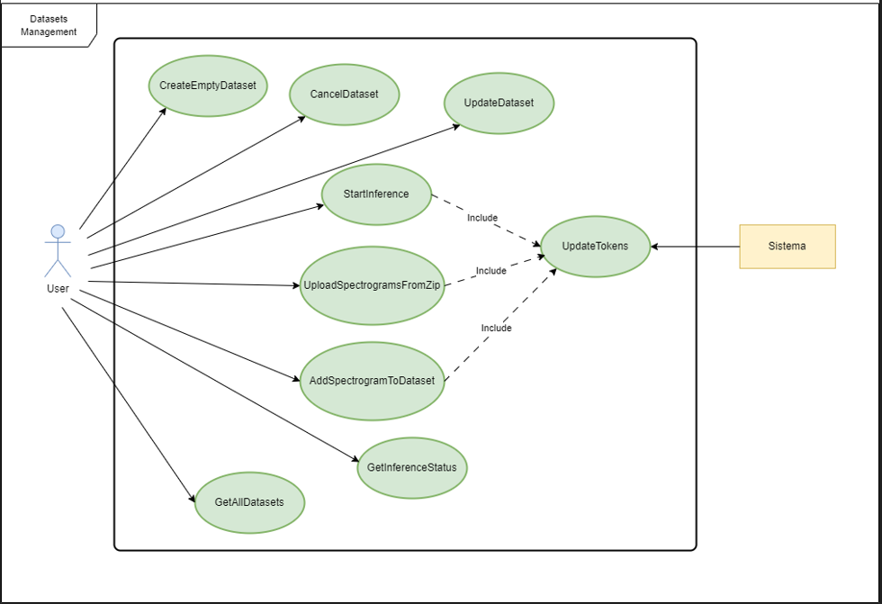

# Inference Management System for Sleep Apnea Syndrome

## Obiettivo del progetto
Il progetto consiste nella realizzazione di un backend per la gestione delle inferenze fatte su immagini (con estensione .png) di spettrogrammi o su cartelle zip, tramite l'utilizzo di due modelli di Deep-Learning pre-addestrati per l'individuazione di apnee notturne.
I modelli messi a disposizione sono stati addestrati su un diverso numero di pazienti, in particolare uno su 10 e l'altro su 20, il che risulta in prestazioni differenti.
Il backend realizzato permette agli utenti di autenticarsi, generare dataset e fare infereza su questi ultimi, nei quali possono essere inserite sia immagini che cartelle zip. Le operazioni di inferenza e l'aggiunta di materiale multimediale sono consentite agli utenti
a condizione che dispongano di un numero sufficiente di token. Quando uno degli utenti esaurisce i token a disposizione, può richiederne all'admin. Il tutto è gestito da un sistema di autenticazione JWT (JSON Web Token).

## Progettazione Database
Il server trova appoggio in un database PostgreSQL, impostato su un server esterno. Le credenziali di accesso, come nome del database, utente, password ed host, sono salvate come variabili di ambiente.
il batabase è formato da tre entità: datasets, spectrograms e Utente, ciascuno con i propri attributi.
Di seguito riportiamo il diagramma relazionale utilizato per la progettazione del database:

    

## Diagrammi dei Casi D'Uso
Utilizziamo i diagrammi dei casi d'uso per poter identificare in maniera chiara gli attori che interagiscono con il sistema e descrivere tale interazioni; inoltre, essi ci forniscono una panoramica chiara delle funzionalità del sistema stesso.

### Attori
Gli attori sono le entità che interagiscono con il nostro sistema. In particolare ne sono state individuate 3 tipologie: Utente, Admin e Sistema

    

### Gestione Utenti
Tale diagramma riporta le azioni offerte dal sistema agli attori

    

### Gestione Datasets
Tale diagramma riporta le azioni offerte dal sistema sui datasets

    

## Diagrammi delle Sequenze
I diagrammi di sequenza sono usati per descrivere l'interazone seuqenziale tra le varie entità all'interno del sistema durante l'esecuzione di una rotta. Di seguito andiamo a riportare dei diagrammi che descrivono il funzionamento delle 11 rotte elaborate

### Creazione di un dataset vuoto

    

### Cancellazione di un dataset

    

### Modifica di un dataset

    

### Inferenza su un dataset

    

### Elenco dei dataset dell'utente loggato

    

### Stato di avanzamento dell'inferenza

    

### Login

    

### Controllo dei token residui

    

### Aggiunta di token ad un utente

    

### Aggiunta di un nuovo spettrogramma

    

### Aggiunta di una cartella zip

    

## Design Pattern Utilizzati

