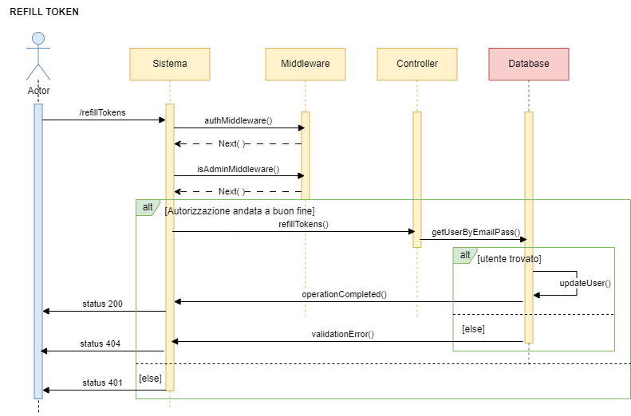
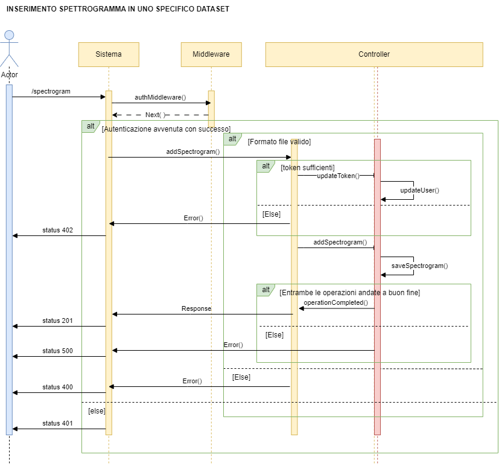

# Inference Management System for Sleep Apnea Syndrome

## Obiettivo del progetto
Il progetto consiste nella realizzazione di un backend per la gestione delle inferenze fatte su immagini (con estensione .png) di spettrogrammi o su cartelle zip, tramite l'utilizzo di due modelli di Deep-Learning pre-addestrati per l'individuazione di apnee notturne.
I modelli messi a disposizione sono stati addestrati su un diverso numero di pazienti, in particolare uno su 10 e l'altro su 20, il che risulta in prestazioni differenti.
Il backend realizzato permette agli utenti di autenticarsi, generare dataset e fare infereza su questi ultimi, nei quali possono essere inserite sia immagini che cartelle zip. Le operazioni di inferenza e l'aggiunta di materiale multimediale sono consentite agli utenti
a condizione che dispongano di un numero sufficiente di token. Quando uno degli utenti esaurisce i token a disposizione, può richiederne all'admin. Il tutto è gestito da un sistema di autenticazione JWT (JSON Web Token).

## Progettazione Database
Il server trova appoggio in un database PostgreSQL, impostato su un server esterno. Le credenziali di accesso, come nome del database, utente, password ed host, sono salvate come variabili di ambiente.
il batabase è formato da tre entità: datasets, spectrograms e Utente, ciascuno con i propri attributi.
Di seguito riportiamo il diagramma relazionale utilizato per la progettazione del database:

<p align="center">
    
</p>

## Diagrammi dei Casi D'Uso
Utilizziamo i diagrammi dei casi d'uso per poter identificare in maniera chiara gli attori che interagiscono con il sistema e descrivere tale interazioni; inoltre, essi ci forniscono una panoramica chiara delle funzionalità del sistema stesso.

### Attori
Gli attori sono le entità che interagiscono con il nostro sistema. In particolare ne sono state individuate 3 tipologie: Utente, Admin e Sistema
<p align="center">
    
</p>

### Gestione Utenti
Tale diagramma riporta le azioni offerte dal sistema agli attori
<p align="center">
    
</p>

### Gestione Datasets
Tale diagramma riporta le azioni offerte dal sistema sui datasets
<p align="center">
    
</p>

## Diagrammi delle Sequenze
I diagrammi di sequenza sono usati per descrivere l'interazone seuqenziale tra le varie entità all'interno del sistema durante l'esecuzione di una rotta. Di seguito andiamo a riportare dei diagrammi che descrivono il funzionamento delle 11 rotte elaborate

### Creazione di un dataset vuoto
<p align="center">
    
</p>

### Cancellazione di un dataset
<p align="center">
    
</p>

### Modifica di un dataset
<p align="center">
    
</p>

### Inferenza su un dataset
<p align="center">
    
</p>

### Elenco dei dataset dell'utente loggato
<p align="center">
    
</p>

### Stato di avanzamento dell'inferenza
<p align="center">
    
</p>

### Login
<p align="center">
    
</p>

### Controllo dei token residui
<p align="center">
    
</p>

### Aggiunta di token ad un utente
<p align="center">
    
</p>

### Aggiunta di un nuovo spettrogramma
<p align="center">
    
</p>

### Aggiunta di una cartella zip
<p align="center">
    
</p>


## Pattern Utilizzati
Durante lo sviuppo del sistema sono stati utilizzati diversi pattern per garantire una gestione maggiormente efficiente del backend
### Design pattern 
**Singleton** - il pattern Singleton è generalmente utilizzato per assicurarsi che una determinata classe presenti una sola istanza, la quale funge da punto di accesso globale. Nel nostro caso la configurazione del database è progettata per essere singleton, garantendo che esista una sola istanza della connessione al database durante l'intero ciclo di vita dell'applicazione, consentendoci di milgiorare le prestazioni e la gestione delle risorse, oltre a fornire metodi per l'autenticazione e la connessione al database stesso.

**DAO** - il pattern DAO è usato per separare la logica di accesso ai dati da quella di business. Nel nostro progetto ogni entità presente nel database (Utenti, Datasets e Spectrograms) presenta un'apposita classe DAO che implementa i metodi CRUD (creazione, lettura, aggiornamento e cancellazione) definiti nell'interfaccia generica. In questo modo è possibile gestire tali operazioni dei dati nel dataset senza esporre i dettagli di implementazione del database stesso.

**Factory Method** - il Factory Method è utilizzato nel nostro progetto per centralizzare ed uniformare gli errori. Tramite la classe errorFactory è fornito un metodo statico che, in base al tipo di errore passato come paramtetro, istanzia e restituisce oggetti delle varie sottoclassi ('CustomError', 'NotFoundError',...). Tale implementazione ci permette di gestire in modo coerente gli errori in tutto il codice e lanciare appropriati messaggi e status code.

**Repository pattern** - il Repository pattern è ampiamente utilizzato nel progetto proposto per separare la logica dei dati da quella di business. Ogni entità principale, come Dataset, User e Spectrogram, è gestita attraverso un repository dedicato. Tale pattern definisce operazioni CRUD oltre che metodi di alto livello per l'accesso ai dati come _getAllDatasetByUser_, _getByName_,...
### Architectural pattern 

**Middleware pattern** - il Middleware pattern è utilizzato per gestire coperazioni comuni di autenticazione e validazione delle richieste HTTP. In particolare i middleware utilizzati sono tre:
1. **authMiddleware**: gestisce l'autenticazione delle richieste; in particolare, la presenza del JWT token e la sua validità.
2. **isAdminMiddleware**: controlla se l'utente autenticato gode dei privilegi di amministratore.
3. **checkValidJson**: gestisce la validazione del formato JSON dele richuieste in entrata.

**MVC** - l'MVC è un pattern architetturale la cui logica funzionamento si basa sulla suddivisione del sistema in tre componenti _Model_, _View_ e _Controller_.

* **Model** - gestisce i dati e la logica di business. Sono definiti i modelli per Dataset, Spectrogram e User in cui sono presenti gli attributi e le relazioni per facilitare l'interazione con il database. Ogni classe modello estende la classe di base "model" di Sequelize definendo attributi specifici
* **View** - non è esplicitamente presente una View, il controller agisce da interfaccia per gestire le richieste e fornire risposte ai clienti
* **Controller** - gestisce l'interazione dell'utente con i dati. Ogni metodo gestisce le rotte ed eventuali errori, valida i dati ed interagisce con il modello corrispondente.


## Avvio


## Rotte
Tramite Postman è possibile eseguire chiamate alle seguenti rotte

### Creazione di un dataset vuoto
#### Rotta
POST http://localhost:3000/emptydataset
#### Descrizione
##### Authorization
Per eseguire questa rotta è necessario che l'utente abbia effettuato l'accesso tramite JWT. 

`Auth Type`: Bearer Token.

`Token`: _token JWT_
##### Parametri richiesta
Nel body devono essere inseriti i seguenti parametri
`name`: nome univoco fornito al nuovo dataset
`description`: descrizione del dataset creato
##### Parametri risposta

#### Esempio
##### Body della richiesta
```
{
  "name":"datasetProva1",
  "description":"datset prova"
}
```
##### Risposta
```
```

### Cancellazione di un dataset
#### Rotta
PUT http://localhost:3000/dataset/:name/cancel
#### Descrizione
##### Authorization
Per eseguire questa rotta è necessario che l'utente abbia effettuato l'accesso tramite JWT. 

`Auth Type`: Bearer Token.

`Token`: _token JWT_
##### Parametri richiesta
All'interno dei _Path Variables_ si deve trovare

`datasetName`: nome del dataset da cancellare
##### Parametri risposta
#### Esempio
##### Risposta
```
```

### Modifica di un dataset
#### Rotta
PATCH http://localhost:3000/dataset/:name/update
#### Descrizione
##### Authorization
Per eseguire questa rotta è necessario che l'utente abbia effettuato l'accesso tramite JWT. 

`Auth Type`: Bearer Token.

`Token`: _token JWT_
##### Parametri richiesta
All'interno del body deve essere contenuto

`updateField`: nome del campo da modificare

e all'interno dei _Path Variables_ si deve trovare

`datasetName`: nome del dataset da modificare
##### Parametri risposta
#### Esempio
##### Body della richiesta
```
```
##### Risposta
```
```

### Inferenza su un dataset
#### Rotta
POST http://localhost:3000/startInference/:datasetName
#### Descrizione
##### Authorization
Per eseguire questa rotta è necessario che l'utente abbia effettuato l'accesso tramite JWT. 

`Auth Type`: Bearer Token.

`Token`: _token JWT_
##### Parametri richiesta
All'interno dei _Path Variables_ si deve trovare

`datasetName`: nome del dataset su cui fare inferenza
##### Parametri risposta
#### Esempio
##### Risposta
```
```

### Elenco dei dataset dell'utente loggato
#### Rotta
GET http://localhost:3000/allDatasets
#### Descrizione
##### Authorization
Per eseguire questa rotta è necessario che l'utente abbia effettuato l'accesso tramite JWT. 

`Auth Type`: Bearer Token.

`Token`: _token JWT_
##### Parametri richiesta
##### Parametri risposta
#### Esempio
##### Risposta
```
```

### Stato di avanzamento dell'inferenza
#### Rotta
GET http://localhost:3000/inferenceStatus/:jobId
#### Descrizione
##### Authorization
Per eseguire questa rotta è necessario che l'utente abbia effettuato l'accesso tramite JWT. 

`Auth Type`: Bearer Token.

`Token`: _token JWT_
##### Parametri richiesta
All'interno dei _Path Variables_ si deve trovare

`jobId`: id dell'inferenza di cui controllare lo stato
##### Parametri risposta
#### Esempio
##### Risposta
```
```

### Login
#### Rotta
POST http://localhost:3000/login
#### Descrizione
##### Authorization
##### Parametri richiesta
All'interno del body deve essere contenuto

`email`: email dell'utente che vuole effettuare il login

`password`: password dell'utente che vuole effettuare il login
##### Parametri risposta
#### Esempio
##### Body della richiesta
```
{
  "email":"admin12@mail.com",
  "password": "admin"
}
```
##### Risposta
```
```

### Controllo dei token residui
#### Rotta
GET http://localhost:3000/remainingTokens
#### Descrizione
##### Authorization
Per eseguire questa rotta è necessario che l'utente abbia effettuato l'accesso tramite JWT. 

`Auth Type`: Bearer Token.

`Token`: _token JWT_
##### Parametri richiesta
##### Parametri risposta
#### Esempio
##### Risposta
```
```

### Aggiunta di token ad un utente
#### Rotta
POST http://localhost:3000/refillTokens
#### Descrizione
##### Authorization
Per eseguire questa rotta è necessario che l'utente abbia effettuato l'accesso tramite JWT. 

`Auth Type`: Bearer Token.

`Token`: _token JWT_
##### Parametri richiesta
All'interno del body deve essere contenuto

`email`: email dell'utente a cui si vogliono assegnare i token

`numToken`: numero di token da assegnare all'utente
##### Parametri risposta
#### Esempio
##### Body della richiesta
```
{
    "userEmail": "prova1@mail.com",
    "newTokens": 100
}
```
##### Risposta
```
```

### Aggiunta di un nuovo spettrogramma
#### Rotta
POST http://localhost:3000/newspectrogram
#### Descrizione
##### Authorization
Per eseguire questa rotta è necessario che l'utente abbia effettuato l'accesso tramite JWT. 

`Auth Type`: Bearer Token.

`Token`: _token JWT_
##### Parametri richiesta
All'interno del body, come _form-data_, deve essere contenuto

`file`: si sceglie il file in formato png da inserire nel dataset 

`datasetName`: nome del dataset in cui inserire i file
##### Parametri risposta
#### Esempio
##### Body della richiesta
##### Risposta
```
```

### Aggiunta di una cartella zip
#### Rotta
POST http://localhost:3000/uploadfilesfromzip
#### Descrizione
##### Authorization
Per eseguire questa rotta è necessario che l'utente abbia effettuato l'accesso tramite JWT. 

`Auth Type`: Bearer Token.

`Token`: _token JWT_
##### Parametri richiesta
All'interno del body, come _form-data_, deve essere contenuto

`file`: si sceglie la cartella zip da inserire nel dataset 

`datasetName`: nome del dataset in cui inserire i file
##### Parametri risposta
#### Esempio
##### Body della richiesta
##### Risposta
```
```
